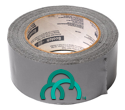

# pcfdev-duct-tape



A rapid way to stick `pcfdev` together.

## Quick Start

If you have your `UAA_API_TOKEN` and are ready to go, you can do a quickstart by cloning the repo, exporting your token, and running the setup command.

```
git clone https://github.com/7hunderbird/pcfdev-duct-tape.git
export UAA_API_TOKEN=<value>
make setup
```

## Download

Before you can run `make download` you'll need to be able to authenticate.

To authenticate you'll need a Pivotal Network login and a `UAA_API_TOKEN`.  At the bottom of the https://network.pivotal.io/users/dashboard/edit-profile page, click on Request New Refresh Token and capture that token.

Set your UAA API Token by running `export UAA_API_TOKEN=<value>`.

```
make download
```

This will allow you to [download](https://github.com/7hunderbird/pcfdev-duct-tape/blob/master/bin/download) the `pcfdev` ISO from the Pivotal Network.

## Install

In order to run `pcfdev`, you'll need the `cf-cli`.  Then `cf dev` is a plugin that gets installed on your computer.

On a macOS computer, running homebrew, you can install the Cloud Foundry CLI and Pivnet CLI with our [install script](https://github.com/7hunderbird/pcfdev-duct-tape/blob/master/bin/install).

```
make install
```

## Run

By default `cf dev` builds the open source Cloud Foundry.  In order to run `pcfdev` we need to have downloaded the ISO, and installed the plugin (see Download and Install above).

Then we've created conveniece wrappers to start and stop `pcfdev` for you, and supply the ISO that you'll store in the local `./iso` folder.

```
make start/stop
```

## Troubleshooing

Clean will stop `pcfdev` and remove all state and files.

```
make clean
```

How to tail all the logs in `cfdev`:

```
find ~/.cfdev -name \*.log -ls 2>&1 | awk '{print $11}' | xargs tail -f
```
